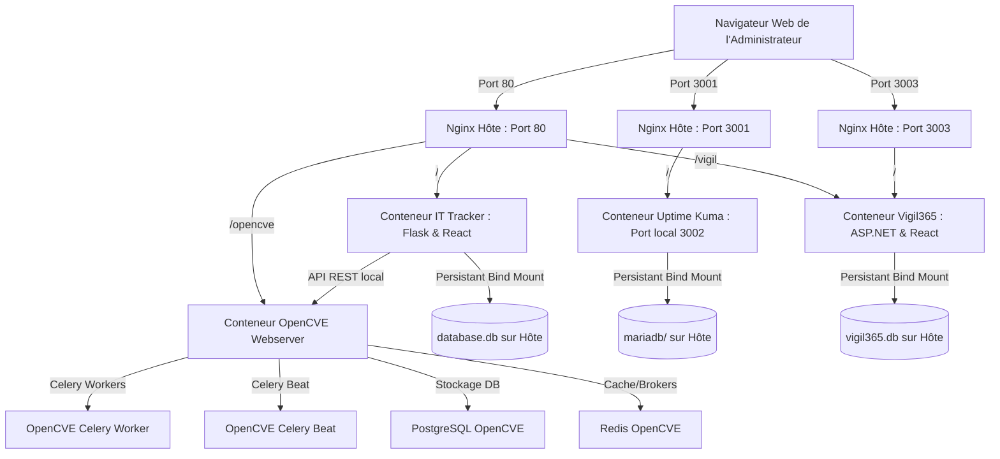

# 🛡️ IT Tracker & OpenCVE - Guide de Déploiement et d'Administration

Bienvenue dans le guide complet d'installation, de configuration et d'administration de la suite **IT Tracker** et de son connecteur de sécurité natif **OpenCVE**.

Ce document explique en détail l'architecture, la configuration de l'environnement, le fonctionnement d'OpenCVE, la gestion des secrets et fournit une **analyse complète de la portabilité** pour installer ce système sur n'importe quel autre serveur.

---

## 🏗️ Architecture Globale & Portabilité

La suite est orchestrée sous forme de conteneurs Docker reliés par un réseau virtuel commun, le tout exposé de manière sécurisée et unifiée par un proxy inverse **Nginx** localisé sur la machine hôte.



### 📋 Portabilité de la solution
Le projet a été spécialement conçu pour être **100 % portable** et prêt pour un déploiement instantané sur n'importe quel autre serveur Linux (Ubuntu, Debian, CentOS, etc.) :
1. **IP Dynamique** : Le script de déploiement `deploy-all.sh` détecte automatiquement l'adresse IP publique de la machine hôte pour configurer le fichier de configuration d'OpenCVE.
2. **Reverse Proxy Nginx Universel** : Le fichier `nginx-opencve.conf` utilise un nom de serveur générique (`server_name _`), ce qui signifie qu'il accepte toutes les requêtes arrivant sur le port 80 du serveur, peu importe son adresse IP ou son nom de domaine DNS.
3. **Contournement STRICT_HOSTS** : OpenCVE s'exécute sous Django qui bloque par défaut les requêtes HTTP si l'en-tête `Host` ne correspond pas à sa configuration interne. Le backend d'IT-Tracker contourne automatiquement cette sécurité grâce à la variable `OPENCVE_HOST_HEADER` qui injecte l'en-tête de Host valide lors de chaque requête API locale.

---

## 🚀 Installation Complète en Une Étape (Recommandée)

Le script de déploiement automatique configure l'intégralité de la pile : installation de Nginx hôte, téléchargement et construction d'OpenCVE et Vigil365, génération des clés de chiffrement et des comptes API, et démarrage des conteneurs.

### Prérequis
- Un serveur sous **Linux** (Debian/Ubuntu recommandé).
- **Docker** et le plugin **Docker Compose** installés.
- Les droits `sudo` activés pour configurer Nginx.

### Déploiement :
Exécutez simplement la commande suivante à la racine du dossier du projet :
```bash
./deploy-all.sh
```

---

## 🔐 Gestion des Secrets & Fichier `.env`

Le backend de l'IT-Tracker a besoin des identifiants API d'OpenCVE pour s'y connecter de manière sécurisée, ainsi que de ses propres identifiants d'administration pour restreindre l'accès à l'inventaire. Ces accès sont configurés dans le fichier `.env` situé à la racine du projet.

### Fichier `.env` type :
```ini
# Informations de connexion OpenCVE pour l'IT-Tracker
OPENCVE_URL=http://opencve-webserver:8000/opencve
OPENCVE_USER=api_admin
OPENCVE_PASSWORD=<mot_de_passe_généré>
OPENCVE_HOST_HEADER=<adresse_ip_du_serveur>

# Informations d'administration de l'IT-Tracker
TRACKER_ADMIN_USER=admin
TRACKER_ADMIN_PASSWORD=<mot_de_passe_généré>

# Intégration Uptime Kuma (Optionnelle)
ENABLE_UPTIME_KUMA=true

# Intégration Vigil365 M365 Security Alert Dashboard (Optionnelle)
ENABLE_VIGIL365=true
VIGIL365_TENANT_ID=YOUR_TENANT_ID
VIGIL365_CLIENT_ID=YOUR_CLIENT_ID
VIGIL365_CLIENT_SECRET=YOUR_CLIENT_SECRET
```

### 🔑 Comment récupérer ou réinitialiser les secrets ?

1. **Identifiants de l'IT-Tracker** :
   Le script `deploy-all.sh` génère automatiquement un mot de passe sécurisé aléatoire de 32 caractères pour l'utilisateur administrateur (`admin`) de l'IT-Tracker.
   - Il sauvegarde ces identifiants dans le fichier **`it_tracker_creds.txt`** à la racine du projet.
   - Il remplit automatiquement le fichier `.env` avec ces informations d'accès.
   - Pour les réinitialiser, modifiez le mot de passe dans `it_tracker_creds.txt` et relancez `./deploy-all.sh`.

2. **Identifiants OpenCVE** :
   Le script `deploy-all.sh` génère également un mot de passe sécurisé aléatoire pour l'utilisateur de l'API OpenCVE (`api_admin`).
   - Il sauvegarde ces identifiants dans le fichier **`opencve_api_creds.txt`** à la racine du projet.
   - Si vous égarez les identifiants ou souhaitez créer un autre administrateur, utilisez la CLI d'OpenCVE embarquée dans le conteneur Docker :
     ```bash
     docker exec -it opencve-webserver opencve create-user <nom_utilisateur> <email> --admin
     ```

### 🛡️ Sécurité de l'Application IT-Tracker

L'application intègre plusieurs couches de protection :
- **Authentification sécurisée par jeton** : Tous les endpoints d'API (sauf `/api/login` et les ressources du frontend) requièrent un en-tête `Authorization: Bearer <token>` valide. Les jetons de session ont une durée de validité de 24 heures et sont stockés de manière sécurisée en base de données.
- **Hachage des mots de passe** : Les mots de passe sont hachés de manière sécurisée en utilisant `werkzeug.security` (PBKDF2/SHA-256).
- **Protection contre le LFI (Local File Inclusion)** : Le protocole `file://` est strictement bloqué lors du traitement des flux RSS.
- **Protection contre le SSRF (Server-Side Request Forgery)** : Les requêtes HTTP/HTTPS vers les adresses de boucle locale (`localhost`, `127.0.0.1`, `::1`) ou les adresses de métadonnées de cloud (`169.254.169.254`) sont explicitement bloquées lors du traitement des flux.
- **En-têtes de sécurité HTTP** : L'application renvoie systématiquement les en-têtes `X-Content-Type-Options: nosniff`, `X-Frame-Options: DENY`, `Referrer-Policy: strict-origin-when-cross-origin`, et une politique de sécurité du contenu (`Content-Security-Policy`) restrictive.

---

## ⚙️ Détail de la Configuration d'OpenCVE

L'ensemble des données d'OpenCVE est stocké de manière isolée pour éviter toute interférence :

- **Fichier de configuration principal** : `opencve_data/conf/opencve.cfg`
  Contient la clé secrète de session, les URL de base de données PostgreSQL, le broker Redis et les paramètres système. Il est monté en lecture seule dans les conteneurs OpenCVE.
- **Base de données PostgreSQL** : Les données CVE, utilisateurs et sessions d'OpenCVE sont écrites dans le volume persistant `./opencve_data/db`.
- **Importation initiale des données CVE** :
  À la fin du script `deploy-all.sh`, OpenCVE lance l'importation de l'intégralité du dictionnaire CPE et CVE (depuis les flux officiels NVD du NIST). Cette tâche tourne en tâche de fond dans le conteneur et prend du temps (environ 30 à 45 minutes selon les performances CPU/Réseau).
  - Pour voir l'avancement de l'importation :
    ```bash
    docker logs -f opencve-webserver
    ```

---

## 🔀 Migration / Déploiement sur un autre serveur (Portabilité)

Si vous devez transférer l'application **IT-Tracker** et l'ensemble de ses services (**OpenCVE**, **Vigil365**, **Uptime Kuma**) sur un autre serveur Linux, tout a été préparé pour que la migration se fasse de manière simple, sécurisée et sans perte de données.

### 📋 Checklist des Données & Volumes Persistants
Avant de migrer, assurez-vous d'emporter les dossiers de données suivants (tous situés à la racine du projet) :
- **`data/`** : Contient `database.db` (Inventaire des actifs, équipements, configuration des alertes & jetons de l'IT-Tracker).
- **`opencve_data/`** : Contient la base de données PostgreSQL d'OpenCVE (dictionnaire CPE/CVE de ~2,8 Go) et le fichier de configuration `opencve.cfg`.
- **`vigil_data/`** : Contient `vigil365.db` (Alertes de sécurité M365 et paramètres de Vigil365).
- **`uptime_data/`** : Contient les données d'Uptime Kuma (sondes, historique, base MariaDB).
- **Secrets & Identifiants** (Optionnel mais recommandé) : `.env`, `it_tracker_creds.txt`, `opencve_api_creds.txt`.

---

### 📦 Procédure de Migration en 3 Étapes

#### Étape 1 : Créer une archive complète du projet sur le serveur source
Sur le serveur actuel, exécutez la commande suivante en `sudo` pour préserver les permissions des conteneurs Docker (PostgreSQL, MariaDB, etc.) :
```bash
cd /home/muc-host/
sudo tar --exclude="IT-TRACKER/venv" \
         --exclude="IT-TRACKER/node-env" \
         --exclude="IT-TRACKER/node_modules" \
         --exclude="IT-TRACKER/__pycache__" \
         -czvf it_tracker_migration.tar.gz IT-TRACKER/
```

#### Étape 2 : Transférer l'archive sur le nouveau serveur
Transférez le fichier `it_tracker_migration.tar.gz` sur votre nouveau serveur via `scp` ou `rsync` :
```bash
scp it_tracker_migration.tar.gz user@nouveau-serveur:/home/user/
```

#### Étape 3 : Extraire et Lancer le déploiement automatique sur le nouveau serveur
Sur la nouvelle machine :
```bash
# 1. Extraire l'archive
tar -xzvf it_tracker_migration.tar.gz
cd IT-TRACKER/

# 2. Lancer le script de déploiement automatique
./deploy-all.sh
```

> [!NOTE]
> Le script `./deploy-all.sh` va automatiquement :
> 1. Détecter la nouvelle adresse IP du serveur.
> 2. Mettre à jour `server_name` dans `opencve_data/conf/opencve.cfg` et `OPENCVE_HOST_HEADER` dans `.env`.
> 3. Installer et configurer Nginx.
> 4. Démarrer et reconnecter tous les conteneurs Docker aux données existantes.

---

### 🔔 Étape Finale : Remettre en place le Cron (si activé)
Si vous aviez configuré la vérification automatique des alertes Teams sur l'ancien serveur, réinstallez la ligne cron sur le nouveau serveur :
```bash
crontab -e
```
Ajoutez la ligne avec l'IP du nouveau serveur ou `localhost` :
```bash
*/30 * * * * curl -s -X POST "http://localhost/api/alerts/cron_check?token=<VOTRE_TOKEN>" > /dev/null
```

---

## 🔔 Configuration des Notifications & Planification (Cron)

L'IT-Tracker intègre un système d'envoi d'alertes par **Microsoft Teams (Webhook)**. Vous pouvez configurer cela directement depuis l'interface utilisateur dans le nouvel onglet **Paramètres**.

### 🎨 Format des Notifications (Adaptive Cards)

Les alertes envoyées à Microsoft Teams utilisent le format moderne **Adaptive Cards (v1.4)** pour offrir un rendu riche, lisible et structuré :
* **Code couleur dynamique (CVSS)** : La couleur de l'en-tête et les indicateurs visuels s'adaptent automatiquement selon le score CVSS :
  * **Critique (score ≥ 9.0)** : Bandeau et pastille rouge (`🔴 CRITIQUE`).
  * **Élevé (score 7.0 - 8.9)** : Bandeau et pastille jaune/orange (`🟠 ÉLEVÉ`).
  * **Moyen (score 4.0 - 6.9)** : Bandeau et pastille bleu (`🟡 MOYEN`).
  * **Bas (score < 4.0)** : Bandeau et pastille vert (`🟢 BAS`).
  * **Non spécifié (N/A)** : Couleur neutre (`⚪ N/A`).
* **Structure claire** : Les détails sur l'actif impacté, la criticité, la date de publication et la description de la faille sont présentés sous forme de blocs structurés et de colonnes d'informations.
* **Bouton d'action direct** : Un bouton d'action moderne permet d'accéder directement au lien source de la CVE ou de l'alerte pour une investigation immédiate.

### ⚙️ Paramètres disponibles :
1. **Activer/Désactiver** les notifications Teams.
2. Définir le **Webhook URL** Teams.
3. Définir le **Score CVSS Minimum** (ex : notification uniquement si CVSS >= 7.0).
4. Définir la **Fréquence de rafraîchissement** :
   * Soit une fréquence gérée par l'application (toutes les 1h, 6h, 12h, 24h) associée à un appel cron régulier (ex: toutes les 30 minutes).
   * Soit **"Géré par le Cron externe (À chaque appel)"** (permettant un contrôle précis au niveau du serveur).

### ⏱️ Planification de la tâche Cron :
Pour automatiser la détection d'alertes, vous devez enregistrer cette tâche dans le planificateur de tâches (**Cron**) de votre serveur.

> [!IMPORTANT]
> Ne lancez pas directement la ligne de planification dans votre terminal. Suivez les étapes ci-dessous :
>
> 1. Ouvrez l'éditeur de configuration Cron de votre serveur en tapant dans votre terminal :
>    ```bash
>    crontab -e
>    ```
>    *(Si c'est la première fois, le système peut vous demander de choisir un éditeur, choisissez `nano` en tapant son numéro, généralement `1`)*.
>
> 2. Descendez tout en bas du fichier ouvert et collez la commande recommandée copiée depuis l'interface, par exemple :
>
>    *   **Option 1 : Planification Standard (toutes les 30 minutes)**
>        ```bash
>        */30 * * * * curl -s -X POST "http://<IP_DU_SERVEUR>/api/alerts/cron_check?token=<VOTRE_TOKEN>" > /dev/null
>        ```
>    *   **Option 2 : Planification aux Heures de Bureau (9h, 12h, 15h - Lundi au Vendredi)**
>        *Sélectionnez "Géré par le Cron externe" dans les paramètres puis configurez :*
>        ```bash
>        0 9,12,15 * * 1-5 curl -s -X POST "http://<IP_DU_SERVEUR>/api/alerts/cron_check?token=<VOTRE_TOKEN>" > /dev/null
>        ```
>
> 3. Sauvegardez et fermez le fichier :
>    - Avec **nano** : appuyez sur `Ctrl + O` puis `Entrée` pour enregistrer, puis `Ctrl + X` pour quitter.
>    - Avec **vim** : tapez `:wq` puis `Entrée`.
>
> Vous devriez voir le message de confirmation : `crontab: installing new crontab`.

*Le jeton de sécurité (`cron_token`) est disponible dans l'onglet **Paramètres** de l'interface utilisateur.*

---

### 📊 Importation et Exportation Excel (Onglet Paramètres)

L'application permet d'exporter et d'importer l'intégralité de l'inventaire via des fichiers Excel (`.xlsx`) directement dans l'onglet **Paramètres** :

1. **Exportation Excel** :
   - **Actifs & Services** : Exporte l'ensemble des actifs avec toutes leurs métadonnées, y compris les **étiquettes (tags)** et les **sources RSS / Vigil**.
   - **Membres de l'Équipe** : Exporte la liste des responsables (trigrammes et adresses email).
   - *Remarque* : Les alertes actives ne sont plus exportées dans le fichier pour garder un document d'inventaire propre et exploitable.

2. **Importation Excel** :
   - Vous permet d'importer des fichiers `.xlsx` pour créer ou mettre à jour des actifs et des membres d'équipe en masse.
   - Propose un aperçu avant validation avec le décompte des membres et actifs détectés.
   - Génère un rapport d'exécution détaillé (nombre d'éléments créés, mis à jour et liste des erreurs/avertissements).

---

## 🛠️ Commandes utiles pour l'Exploitation

*   **Démarrer/Reconstruire l'IT-Tracker** :
    ```bash
    docker compose up -d --build --force-recreate
    ```
*   **Consulter les logs de l'IT-Tracker** :
    ```bash
    docker compose logs -f it-tracker
    ```
*   **Forcer une resynchronisation immédiate de l'inventaire (Backend)** :
    ```bash
    curl -X POST http://localhost:5000/api/alerts/refresh
    ```
*   **Accès aux interfaces web** :
    - **IT-Tracker** : `http://<IP_DU_SERVEUR>/`
    - **Console OpenCVE** : `http://<IP_DU_SERVEUR>/opencve/`
    - **Vigil365 (Sécurisé par authentification IT-Tracker)** : `http://<IP_DU_SERVEUR>/vigil/`
    - **Uptime Kuma** : `http://<IP_DU_SERVEUR>:3001/`
