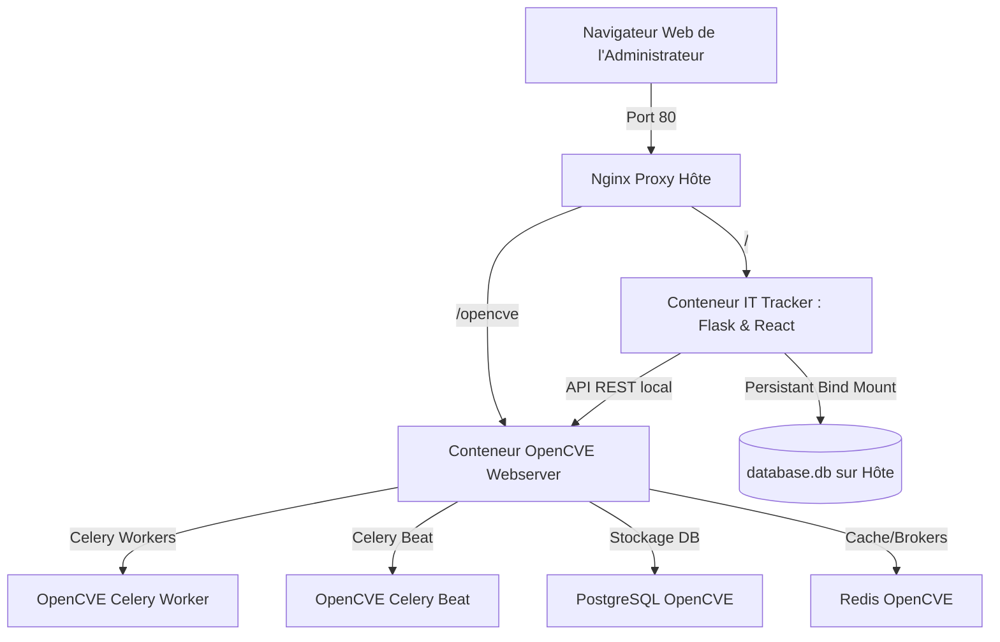

# 🛡️ Herakles IT Tracker & OpenCVE - Guide de Déploiement et d'Administration

Bienvenue dans le guide complet d'installation, de configuration et d'administration de la suite **Herakles IT Tracker** et de son connecteur de sécurité natif **OpenCVE**.

Ce document explique en détail l'architecture, la configuration de l'environnement, le fonctionnement d'OpenCVE, la gestion des secrets et fournit une **analyse complète de la portabilité** pour installer ce système sur n'importe quel autre serveur.

---

## 🏗️ Architecture Globale & Portabilité

La suite est orchestrée sous forme de conteneurs Docker reliés par un réseau virtuel commun, le tout exposé de manière sécurisée et unifiée par un proxy inverse **Nginx** localisé sur la machine hôte.



### 📋 Portabilité de la solution
Le projet a été spécialement conçu pour être **100 % portable** et prêt pour un déploiement instantané sur n'importe quel autre serveur Linux (Ubuntu, Debian, CentOS, etc.) :
1. **IP Dynamique** : Le script de déploiement `deploy-all.sh` détecte automatiquement l'adresse IP publique de la machine hôte pour configurer le fichier de configuration d'OpenCVE.
2. **Reverse Proxy Nginx Universel** : Le fichier `nginx-opencve.conf` utilise un nom de serveur générique (`server_name _`), ce qui signifie qu'il accepte toutes les requêtes arrivant sur le port 80 du serveur, peu importe son adresse IP ou son nom de domaine DNS.
3. **Contournement STRICT_HOSTS** : OpenCVE s'exécute sous Django qui bloque par défaut les requêtes HTTP si l'en-tête `Host` ne correspond pas à sa configuration interne. Le backend d'IT-Tracker contourne automatiquement cette sécurité grâce à la variable `OPENCVE_HOST_HEADER` qui injecte l'en-tête de Host valide lors de chaque requête API locale.

---

## 🚀 Installation Complète en Une Étape (Recommandée)

Le script de déploiement automatique configure l'intégralité de la pile : installation de Nginx hôte, téléchargement et construction d'OpenCVE, génération des clés de chiffrement et des comptes API, et démarrage des conteneurs.

### Prérequis
- Un serveur sous **Linux** (Debian/Ubuntu recommandé).
- **Docker** et le plugin **Docker Compose** installés.
- Les droits `sudo` activés pour configurer Nginx.

### Déploiement :
Exécutez simplement la commande suivante à la racine du dossier du projet :
```bash
./deploy-all.sh
```

---

## 🔐 Gestion des Secrets & Fichier `.env`

Le backend de l'IT-Tracker a besoin des identifiants API d'OpenCVE pour s'y connecter de manière sécurisée. Ces accès sont configurés dans le fichier `.env` situé à la racine du projet.

### Fichier `.env` type :
```ini
# Informations de connexion OpenCVE pour l'IT-Tracker
OPENCVE_URL=http://opencve-webserver:8000/opencve
OPENCVE_USER=api_admin
OPENCVE_PASSWORD=<mot_de_passe_généré>
OPENCVE_HOST_HEADER=<adresse_ip_du_serveur>
```

### 🔑 Comment récupérer ou réinitialiser les secrets OpenCVE ?

1. **À la première installation** :
   Le script `deploy-all.sh` génère automatiquement un mot de passe sécurisé aléatoire de 32 caractères pour l'utilisateur API administrateur (`api_admin`).
   - Il sauvegarde ces identifiants dans un fichier sécurisé nommé **`opencve_api_creds.txt`** à la racine du projet.
   - Il remplit automatiquement le fichier `.env` avec ces informations d'accès. Vous n'avez rien à faire !

2. **Lecture manuelle des secrets** :
   Si vous devez reconnecter manuellement le backend ou récupérer le mot de passe, lisez le fichier d'identification :
   ```bash
   cat opencve_api_creds.txt
   ```

3. **Génération manuelle d'un nouvel utilisateur dans OpenCVE** :
   Si vous égarez les identifiants ou souhaitez créer un autre administrateur, utilisez la CLI d'OpenCVE embarquée dans le conteneur Docker :
   ```bash
   docker exec -it opencve-webserver opencve create-user <nom_utilisateur> <email> --admin
   ```
   *Le conteneur vous demandera de saisir et de confirmer le nouveau mot de passe de manière sécurisée.*

---

## ⚙️ Détail de la Configuration d'OpenCVE

L'ensemble des données d'OpenCVE est stocké de manière isolée pour éviter toute interférence :

- **Fichier de configuration principal** : `opencve_data/conf/opencve.cfg`
  Contient la clé secrète de session, les URL de base de données PostgreSQL, le broker Redis et les paramètres système. Il est monté en lecture seule dans les conteneurs OpenCVE.
- **Base de données PostgreSQL** : Les données CVE, utilisateurs et sessions d'OpenCVE sont écrites dans le volume persistant `./opencve_data/db`.
- **Importation initiale des données CVE** :
  À la fin du script `deploy-all.sh`, OpenCVE lance l'importation de l'intégralité du dictionnaire CPE et CVE (depuis les flux officiels NVD du NIST). Cette tâche tourne en tâche de fond dans le conteneur et prend du temps (environ 30 à 45 minutes selon les performances CPU/Réseau).
  - Pour voir l'avancement de l'importation :
    ```bash
    docker logs -f opencve-webserver
    ```

---

## 🔀 Migration / Déploiement sur un autre serveur (Portabilité)

Si vous devez transférer ou installer l'IT-Tracker sur un serveur physique ou virtuel tiers, suivez ces étapes simples :

### Étape 1 : Copier le projet sur le nouveau serveur
Archivez et transférez l'intégralité du répertoire du projet (par exemple via rsync ou scp) :
```bash
rsync -avz --exclude="venv" --exclude="node-env" --exclude="node_modules" /home/rustdesk-host/IT-TRACKER/ user@nouveau-serveur:/var/www/it-tracker/
```

### Étape 2 : Lancer le script d'installation automatique
Sur le nouveau serveur, lancez simplement :
```bash
cd /var/www/it-tracker/
./deploy-all.sh
```
> [!NOTE]
> Le script détectera la nouvelle IP, re-générera un fichier `opencve.cfg` adapté, et mettra automatiquement à jour le fichier `.env` avec la nouvelle adresse IP pour `OPENCVE_HOST_HEADER`.

### Étape 3 : Conserver ou migrer votre historique d'inventaire
- **Conserver l'inventaire existant** : Copiez le dossier `data/` (contenant le fichier `database.db` SQLite de l'inventaire) de l'ancien serveur vers le nouveau. Le conteneur se chargera de lire le fichier sans aucune perte de données.
- **Conserver les données OpenCVE pré-importées** : Pour éviter de réimporter le dictionnaire d'origine (ce qui consomme de la bande passante), vous pouvez également copier le dossier `opencve_data/` sur le nouveau serveur avant de lancer le script.

---

## 🛠️ Commandes utiles pour l'Exploitation

*   **Démarrer/Reconstruire l'IT-Tracker** :
    ```bash
    docker compose up -d --build --force-recreate
    ```
*   **Consulter les logs de l'IT-Tracker** :
    ```bash
    docker compose logs -f it-tracker
    ```
*   **Forcer une resynchronisation immédiate de l'inventaire (Backend)** :
    ```bash
    curl -X POST http://localhost:5000/api/alerts/refresh
    ```
*   **Accès aux interfaces web** :
    - **IT-Tracker** : `http://<IP_DU_SERVEUR>/`
    - **Console OpenCVE** : `http://<IP_DU_SERVEUR>/opencve/`
