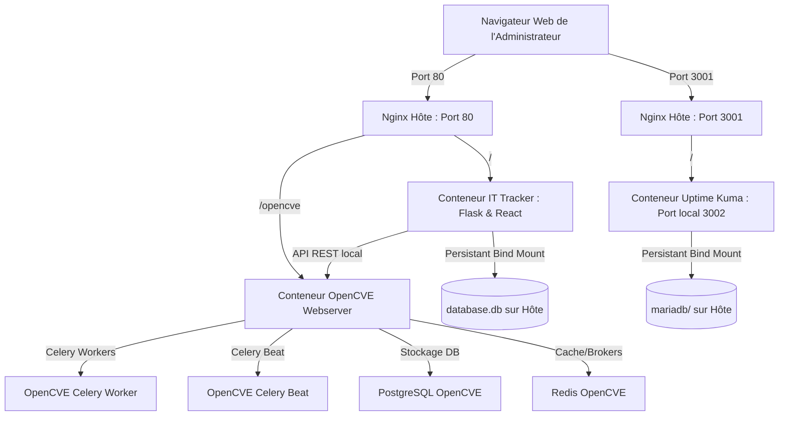

# 🛡️ IT Tracker & OpenCVE - Guide de Déploiement et d'Administration

Bienvenue dans le guide complet d'installation, de configuration et d'administration de la suite **IT Tracker** et de son connecteur de sécurité natif **OpenCVE**.

Ce document explique en détail l'architecture, la configuration de l'environnement, le fonctionnement d'OpenCVE, la gestion des secrets et fournit une **analyse complète de la portabilité** pour installer ce système sur n'importe quel autre serveur.

---

## 🏗️ Architecture Globale & Portabilité

La suite est orchestrée sous forme de conteneurs Docker reliés par un réseau virtuel commun, le tout exposé de manière sécurisée et unifiée par un proxy inverse **Nginx** localisé sur la machine hôte.



### 📋 Portabilité de la solution
Le projet a été spécialement conçu pour être **100 % portable** et prêt pour un déploiement instantané sur n'importe quel autre serveur Linux (Ubuntu, Debian, CentOS, etc.) :
1. **IP Dynamique** : Le script de déploiement `deploy-all.sh` détecte automatiquement l'adresse IP publique de la machine hôte pour configurer le fichier de configuration d'OpenCVE.
2. **Reverse Proxy Nginx Universel** : Le fichier `nginx-opencve.conf` utilise un nom de serveur générique (`server_name _`), ce qui signifie qu'il accepte toutes les requêtes arrivant sur le port 80 du serveur, peu importe son adresse IP ou son nom de domaine DNS.
3. **Contournement STRICT_HOSTS** : OpenCVE s'exécute sous Django qui bloque par défaut les requêtes HTTP si l'en-tête `Host` ne correspond pas à sa configuration interne. Le backend d'IT-Tracker contourne automatiquement cette sécurité grâce à la variable `OPENCVE_HOST_HEADER` qui injecte l'en-tête de Host valide lors de chaque requête API locale.

---

## 🚀 Installation Complète en Une Étape (Recommandée)

Le script de déploiement automatique configure l'intégralité de la pile : installation de Nginx hôte, téléchargement et construction d'OpenCVE, génération des clés de chiffrement et des comptes API, et démarrage des conteneurs.

### Prérequis
- Un serveur sous **Linux** (Debian/Ubuntu recommandé).
- **Docker** et le plugin **Docker Compose** installés.
- Les droits `sudo` activés pour configurer Nginx.

### Déploiement :
Exécutez simplement la commande suivante à la racine du dossier du projet :
```bash
./deploy-all.sh
```

---

## 🔐 Gestion des Secrets & Fichier `.env`

Le backend de l'IT-Tracker a besoin des identifiants API d'OpenCVE pour s'y connecter de manière sécurisée, ainsi que de ses propres identifiants d'administration pour restreindre l'accès à l'inventaire. Ces accès sont configurés dans le fichier `.env` situé à la racine du projet.

### Fichier `.env` type :
```ini
# Informations de connexion OpenCVE pour l'IT-Tracker
OPENCVE_URL=http://opencve-webserver:8000/opencve
OPENCVE_USER=api_admin
OPENCVE_PASSWORD=<mot_de_passe_généré>
OPENCVE_HOST_HEADER=<adresse_ip_du_serveur>

# Informations d'administration de l'IT-Tracker
TRACKER_ADMIN_USER=admin
TRACKER_ADMIN_PASSWORD=<mot_de_passe_généré>

# Intégration Uptime Kuma (Optionnelle)
ENABLE_UPTIME_KUMA=true
```

### 🔑 Comment récupérer ou réinitialiser les secrets ?

1. **Identifiants de l'IT-Tracker** :
   Le script `deploy-all.sh` génère automatiquement un mot de passe sécurisé aléatoire de 32 caractères pour l'utilisateur administrateur (`admin`) de l'IT-Tracker.
   - Il sauvegarde ces identifiants dans le fichier **`it_tracker_creds.txt`** à la racine du projet.
   - Il remplit automatiquement le fichier `.env` avec ces informations d'accès.
   - Pour les réinitialiser, modifiez le mot de passe dans `it_tracker_creds.txt` et relancez `./deploy-all.sh`.

2. **Identifiants OpenCVE** :
   Le script `deploy-all.sh` génère également un mot de passe sécurisé aléatoire pour l'utilisateur de l'API OpenCVE (`api_admin`).
   - Il sauvegarde ces identifiants dans le fichier **`opencve_api_creds.txt`** à la racine du projet.
   - Si vous égarez les identifiants ou souhaitez créer un autre administrateur, utilisez la CLI d'OpenCVE embarquée dans le conteneur Docker :
     ```bash
     docker exec -it opencve-webserver opencve create-user <nom_utilisateur> <email> --admin
     ```

### 🛡️ Sécurité de l'Application IT-Tracker

L'application intègre plusieurs couches de protection :
- **Authentification sécurisée par jeton** : Tous les endpoints d'API (sauf `/api/login` et les ressources du frontend) requièrent un en-tête `Authorization: Bearer <token>` valide. Les jetons de session ont une durée de validité de 24 heures et sont stockés de manière sécurisée en base de données.
- **Hachage des mots de passe** : Les mots de passe sont hachés de manière sécurisée en utilisant `werkzeug.security` (PBKDF2/SHA-256).
- **Protection contre le LFI (Local File Inclusion)** : Le protocole `file://` est strictement bloqué lors du traitement des flux RSS.
- **Protection contre le SSRF (Server-Side Request Forgery)** : Les requêtes HTTP/HTTPS vers les adresses de boucle locale (`localhost`, `127.0.0.1`, `::1`) ou les adresses de métadonnées de cloud (`169.254.169.254`) sont explicitement bloquées lors du traitement des flux.
- **En-têtes de sécurité HTTP** : L'application renvoie systématiquement les en-têtes `X-Content-Type-Options: nosniff`, `X-Frame-Options: DENY`, `Referrer-Policy: strict-origin-when-cross-origin`, et une politique de sécurité du contenu (`Content-Security-Policy`) restrictive.

---

## ⚙️ Détail de la Configuration d'OpenCVE

L'ensemble des données d'OpenCVE est stocké de manière isolée pour éviter toute interférence :

- **Fichier de configuration principal** : `opencve_data/conf/opencve.cfg`
  Contient la clé secrète de session, les URL de base de données PostgreSQL, le broker Redis et les paramètres système. Il est monté en lecture seule dans les conteneurs OpenCVE.
- **Base de données PostgreSQL** : Les données CVE, utilisateurs et sessions d'OpenCVE sont écrites dans le volume persistant `./opencve_data/db`.
- **Importation initiale des données CVE** :
  À la fin du script `deploy-all.sh`, OpenCVE lance l'importation de l'intégralité du dictionnaire CPE et CVE (depuis les flux officiels NVD du NIST). Cette tâche tourne en tâche de fond dans le conteneur et prend du temps (environ 30 à 45 minutes selon les performances CPU/Réseau).
  - Pour voir l'avancement de l'importation :
    ```bash
    docker logs -f opencve-webserver
    ```

---

## 🔀 Migration / Déploiement sur un autre serveur (Portabilité)

Si vous devez transférer ou installer l'IT-Tracker sur un serveur physique ou virtuel tiers, suivez ces étapes simples :

### Étape 1 : Copier le projet sur le nouveau serveur
Archivez et transférez l'intégralité du répertoire du projet (par exemple via rsync ou scp) :
```bash
rsync -avz --exclude="venv" --exclude="node-env" --exclude="node_modules" /home/host/IT-TRACKER/ user@nouveau-serveur:/var/www/it-tracker/
```

### Étape 2 : Lancer le script d'installation automatique
Sur le nouveau serveur, lancez simplement :
```bash
cd /var/www/it-tracker/
./deploy-all.sh
```
> [!NOTE]
> Le script détectera la nouvelle IP, re-générera un fichier `opencve.cfg` adapté, et mettra automatiquement à jour le fichier `.env` avec la nouvelle adresse IP pour `OPENCVE_HOST_HEADER`.

### Étape 3 : Conserver ou migrer votre historique d'inventaire
- **Conserver l'inventaire existant** : Copiez le dossier `data/` (contenant le fichier `database.db` SQLite de l'inventaire) de l'ancien serveur vers le nouveau. Le conteneur se chargera de lire le fichier sans aucune perte de données.
- **Conserver la base de données OpenCVE pré-importée (Hautement Recommandé)** : 
  Pour éviter de réimporter et de retélécharger l'intégralité de l'historique du NVD depuis 2002 (ce qui prend environ 2h30 à 3h en raison des limites de débit du NIST), vous devez copier le dossier `opencve_data/` (qui pèse actuellement **environ 2,8 Go**) sur le nouveau serveur.
  
  **Commande de sauvegarde (archive compressée) :**
  ```bash
  tar -czvf opencve_backup.tar.gz opencve_data/
  ```
  **Commande de restauration (sur le nouveau serveur) :**
  ```bash
  tar -xzvf opencve_backup.tar.gz
  ```
- **Conserver ou migrer les données d'Uptime Kuma** :
  Si vous utilisez Uptime Kuma et souhaitez migrer ses configurations (sondes, notifications, etc.), copiez le contenu du dossier `uptime_data/` (contenant la configuration et le dossier de base de données `mariadb/`) de l'ancien serveur/instance vers le nouveau dossier `./uptime_data/` avant de lancer `./deploy-all.sh`.

---

## 🔔 Configuration des Notifications & Planification (Cron)

L'IT-Tracker intègre un système d'envoi d'alertes par **Microsoft Teams (Webhook)**. Vous pouvez configurer cela directement depuis l'interface utilisateur dans le nouvel onglet **Paramètres**.

### ⚙️ Paramètres disponibles :
1. **Activer/Désactiver** les notifications Teams.
2. Définir le **Webhook URL** Teams.
3. Définir le **Score CVSS Minimum** (ex : notification uniquement si CVSS >= 7.0).
4. Définir la **Fréquence de rafraîchissement** :
   * Soit une fréquence gérée par l'application (toutes les 1h, 6h, 12h, 24h) associée à un appel cron régulier (ex: toutes les 30 minutes).
   * Soit **"Géré par le Cron externe (À chaque appel)"** (permettant un contrôle précis au niveau du serveur).

### ⏱️ Planification de la tâche Cron :
Pour automatiser la détection d'alertes, ajoutez une ligne dans le `crontab` de votre serveur hôte (`crontab -e`) :

*   **Option 1 : Planification Standard (toutes les 30 minutes)**
    ```bash
    */30 * * * * curl -s -X POST "http://<IP_DU_SERVEUR>/api/alerts/cron_check?token=<VOTRE_TOKEN>" > /dev/null
    ```
*   **Option 2 : Planification aux Heures de Bureau (9h, 12h, 15h - Lundi au Vendredi)**
    *Sélectionnez "Géré par le Cron externe" dans les paramètres puis configurez :*
    ```bash
    0 9,12,15 * * 1-5 curl -s -X POST "http://<IP_DU_SERVEUR>/api/alerts/cron_check?token=<VOTRE_TOKEN>" > /dev/null
    ```

*Le jeton de sécurité (`cron_token`) est disponible dans l'onglet **Paramètres** de l'interface utilisateur.*

---

## 🛠️ Commandes utiles pour l'Exploitation

*   **Démarrer/Reconstruire l'IT-Tracker** :
    ```bash
    docker compose up -d --build --force-recreate
    ```
*   **Consulter les logs de l'IT-Tracker** :
    ```bash
    docker compose logs -f it-tracker
    ```
*   **Forcer une resynchronisation immédiate de l'inventaire (Backend)** :
    ```bash
    curl -X POST http://localhost:5000/api/alerts/refresh
    ```
*   **Accès aux interfaces web** :
    - **IT-Tracker** : `http://<IP_DU_SERVEUR>/`
    - **Console OpenCVE** : `http://<IP_DU_SERVEUR>/opencve/`
    - **Uptime Kuma** : `http://<IP_DU_SERVEUR>:3001/`
